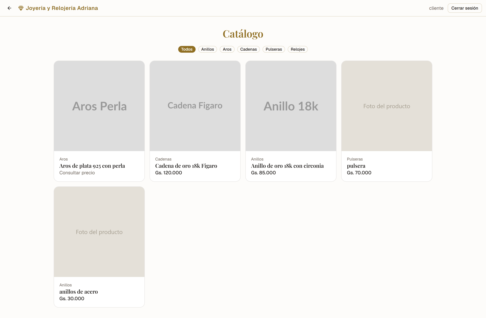
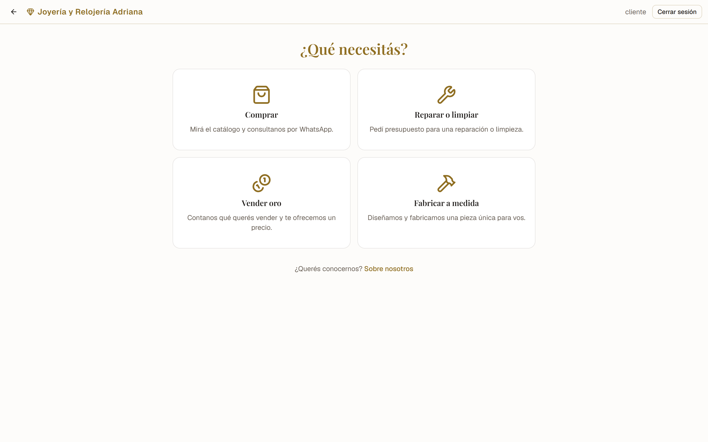
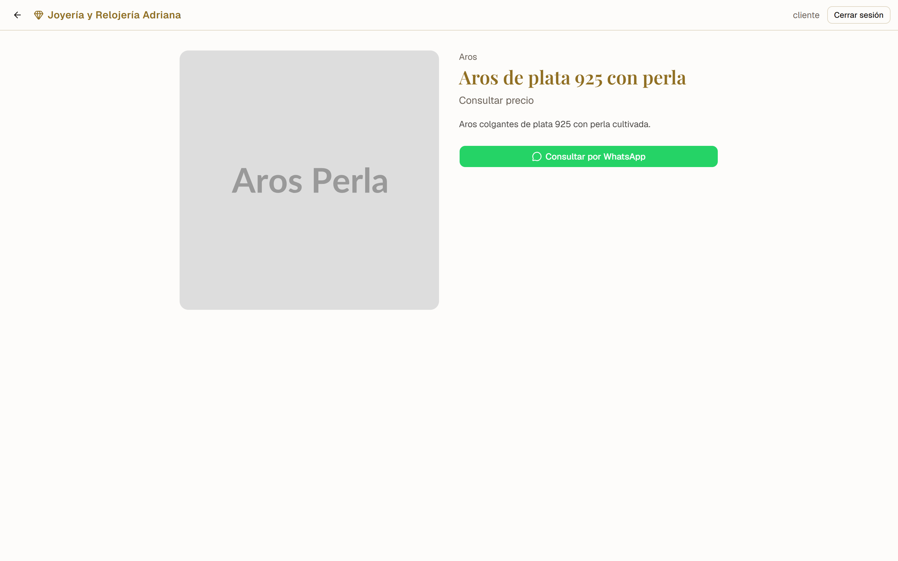
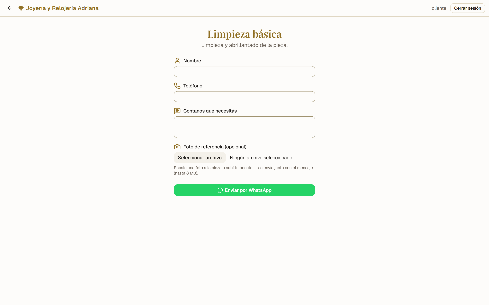
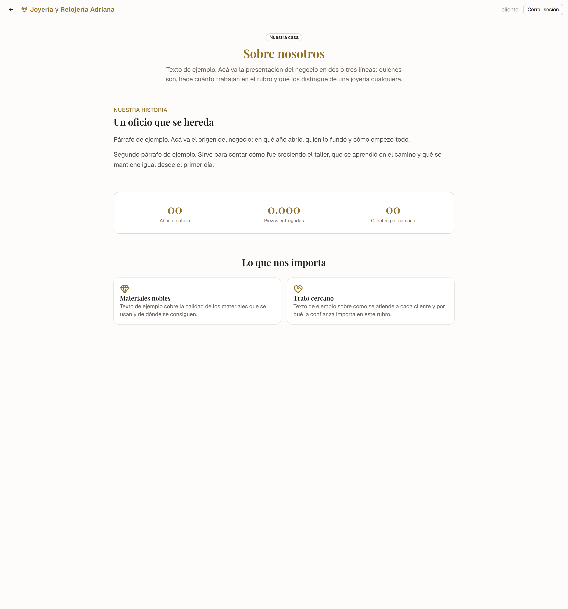
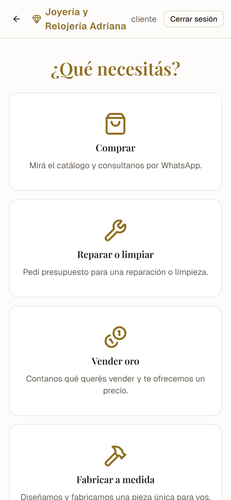
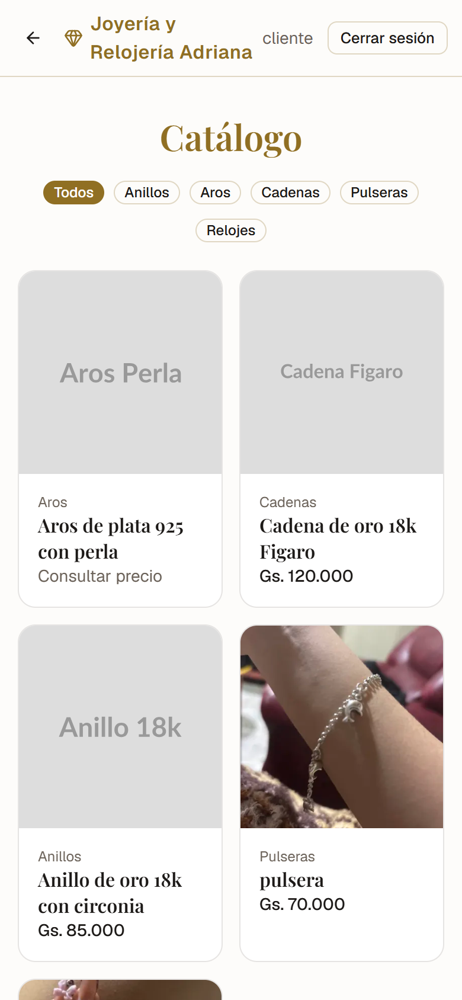

# Joyería y Relojería Adriana

Sitio de catálogo y captación de pedidos para una joyería: catálogo de
productos, solicitudes de servicio (reparación, limpieza, fabricación a medida)
y compra de oro, con panel de administración.

El negocio cierra por WhatsApp, así que el sitio no vende online: su trabajo es
que el cliente llegue al chat con todo escrito, y que el negocio tenga la
solicitud registrada aunque la conversación nunca ocurra.

**[Ver el sitio](https://joyeria-adriana.onrender.com)** · Next.js 16 · Prisma 7
· PostgreSQL · NextAuth v5 · Tailwind 4

<p align="center">
  
</p>

<table>
  <tr>
    <td width="50%"></td>
    <td width="50%"></td>
  </tr>
  <tr>
    <td>Inicio</td>
    <td>Ficha de producto</td>
  </tr>
  <tr>
    <td></td>
    <td></td>
  </tr>
  <tr>
    <td>Solicitud de servicio</td>
    <td>Sobre nosotros</td>
  </tr>
</table>

<p align="center">
  
  
</p>

## Decisiones que vale la pena mirar

Lo interesante de este proyecto no es el CRUD. Es esto:

### Los datos de contacto se guardan cifrados

Nombre, teléfono, email y el texto de cada solicitud se cifran con AES-256-GCM
antes de tocar la base ([`src/lib/crypto.ts`](src/lib/crypto.ts)). Eso plantea un
problema evidente: si el teléfono está cifrado, no se puede buscar por teléfono.

La salida son **índices ciegos**: un HMAC determinístico del valor normalizado,
guardado en una columna aparte. Se busca contra el índice, nunca contra el dato.

Cada valor guardado lleva además una **huella de la clave** que lo cifró:

```
v1.huella.iv.tag.dato
```

Son ocho caracteres derivados por HMAC, así que no revelan la clave y se pueden
loguear. Existen porque este bug ya ocurrió: al cambiar `ENCRYPTION_KEY`, el
descifrado fallaba sin error y el panel terminaba mostrando base64 en el lugar
del nombre del cliente. Con la huella, el sistema distingue "esto se cifró con
otra clave" de "esto está corrupto", y lo dice.

`npm run check:key` verifica que un entorno tenga la clave correcta y sale con
código 1 si encuentra datos de otra. Sirve en CI o después de desplegar.

### El panel se verifica dos veces, y no por paranoia

El proxy ([`src/proxy.ts`](src/proxy.ts)) comprueba la **firma** del JWT, no que
la cookie exista. Antes solo miraba lo segundo: con eso, mandar una cookie con
cualquier basura alcanzaba para que la página se renderizara, y el HTML del
panel viajaba en el cuerpo de la respuesta aunque después redirigiera.

Después, cada acción de escritura vuelve a comprobar la sesión antes de tocar la
base. Una cosa protege la lectura y la otra la escritura.

### El control de acceso vive en el proxy, no en un layout

Estuvo en un layout y dejó de funcionar en silencio al agregar los `loading.tsx`.
Con un límite de Suspense arriba, el layout se renderiza cuando el shell de la
respuesta ya salió, y un `redirect()` en ese momento no produce una redirección
del servidor: la página se sirve igual, con código 200. El proxy corre antes de
renderizar y no depende de eso.

### Las fotos se validan por su contenido

La extensión y el tipo MIME que manda el navegador son texto libre y se falsean
sin esfuerzo. [`src/lib/uploads.ts`](src/lib/uploads.ts) mira los primeros bytes
reales del archivo.

Y antes de mandar la URL de una foto por WhatsApp se envía una versión
transformada, no la original: además de pesar menos, **le quita los metadatos
EXIF**. Las fotos de celular traen las coordenadas GPS de dónde se tomaron —la
casa del cliente— y esa URL termina compartida en un chat.

### El dorado está calculado, no elegido

`#906f23` es el tono más claro que todavía da 4.68:1 con letra blanca encima y
4.57:1 como texto sobre el fondo, o sea WCAG AA en los dos usos. Un oro más
brillante sobre blanco no llega al mínimo en ninguno.

El movimiento usa tokens compartidos entre Tailwind y Material UI para que los
componentes de las dos capas se muevan igual, solo anima `transform` y
`opacity`, y todo tiene variante para `prefers-reduced-motion`.

## Cómo correrlo

Hace falta Node 22+ y una base PostgreSQL.

```bash
git clone https://github.com/angelmaciel/joyeria-adriana.git
cd joyeria-adriana
npm install

cp .env.example .env      # completar los valores
npm run db:migrate
npm run db:seed           # catálogo de ejemplo
npm run dev
```

Cada variable está explicada en [`.env.example`](.env.example). Las dos que no
se pueden improvisar:

- **`ENCRYPTION_KEY`** — se genera una vez con `openssl rand -base64 32` y no se
  cambia nunca. Todos los entornos llevan el mismo valor. Cambiarla deja ilegible
  todo lo guardado y rompe en silencio las búsquedas por teléfono.
- **`AUTH_SECRET`** — firma las sesiones del panel.

El seed crea una cuenta de administración solo si se definen `SEED_ADMIN_EMAIL`
y `SEED_ADMIN_PASSWORD`. No hay credenciales en el código.

## Comandos

| Comando | Qué hace |
| --- | --- |
| `npm run dev` | Servidor de desarrollo |
| `npm run build` | Compilación de producción |
| `npm run lint` | ESLint |
| `npm run db:migrate` | Migraciones de Prisma |
| `npm run db:seed` | Carga el catálogo de ejemplo |
| `npm run check:key` | Verifica que el entorno tenga la clave de cifrado correcta |
| `npm run capturas` | Regenera las capturas de `docs/capturas/` |

`npm run capturas` usa el Chrome o Edge ya instalado —no descarga ningún
navegador— y toma la ruta al ejecutable de `CHROME_PATH`.

## Estructura

```
src/
  app/
    (client)/          Público: inicio, catálogo, servicios, vender oro, sobre nosotros
    producto/[slug]/   Ficha de producto
    admin/(protected)/ Panel: dashboard, productos, solicitudes, compra de oro
    admin/login/       Ingreso y recuperación de contraseña
  components/          Componentes propios
  components/ui/       shadcn/ui — se regeneran, no se editan a mano
  lib/                 Server actions, cifrado, validaciones, uploads, mail, WhatsApp
  proxy.ts             Control de acceso
prisma/                Esquema, migraciones y seed
scripts/               Utilidades: verificación de clave y capturas
docs/capturas/         Capturas del README
```

## Más

- [DEPLOY.md](DEPLOY.md) — despliegue en Vercel y variables de entorno
- [docs/CONVENCIONES.md](docs/CONVENCIONES.md) — convenciones internas y el porqué de cada regla

## Licencia

Proyecto de portafolio. El código se puede leer y aprender de él; la marca, las
fotos y el contenido del negocio no son reutilizables.
